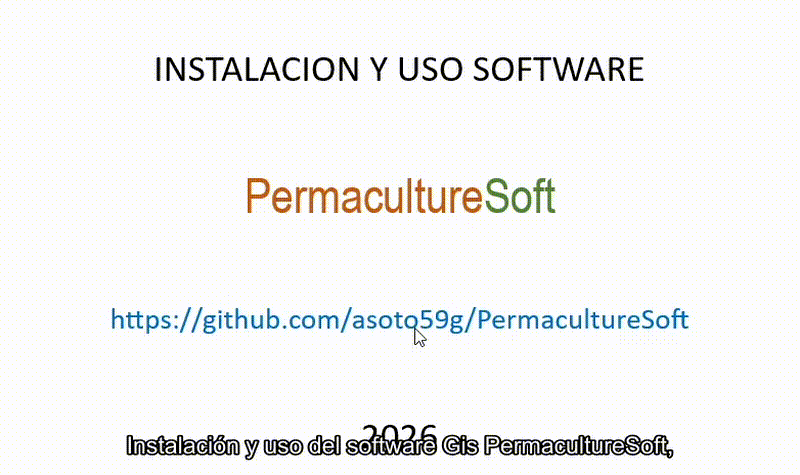

<p align="center">
  <a href="https://github.com/asoto59g/PermacultureSoft">
    
  </a>
</p>



<p align="center">
  
  <a href="LICENSE"></a>
  
  
  
</p>

SIG web para diseño de paisaje en permacultura. Se sube un modelo digital de
elevación (DEM) de la finca y la plataforma deriva de él todo lo que depende del
terreno: cuencas y drenaje, presión de agua por gravedad, sitios de embalse,
keylines, redes de tubería con presupuesto, trazo de caminos de menor costo,
aptitud de edificación, sombra solar y series climáticas del sitio.

> Herramienta de **prefactibilidad**. Los cálculos hidráulicos, de movimiento de
> tierra y de costos son órdenes de magnitud para comparar alternativas. No
> sustituyen diseño de ingeniería, estudio de suelos ni levantamiento topográfico
> de detalle, y no constituyen cotización.

---

## Qué hace

| Escala de Permanencia | Implementado |
| --- | --- |
| 1 · Clima | Series diarias, mensuales y anuales de lluvia, temperatura, ET0, radiación y humedad. Normal de 5 a 30 años, año en curso y pronóstico de 10 días |
| 2 · Geografía | Carga de DEM, curvas de nivel, polígono envolvente, mapas de pendiente, orientación, sombreado y elevación, consulta de cota puntual, medición |
| 3 · Agua | Delineación de cuencas, acumulación de flujo y humedad topográfica, campo de presión por gravedad, aptitud de embalse, diseño de tubería con pérdida de carga y presupuesto |
| 4 · Acceso | Trazo de camino de menor costo con control de pendiente máxima, perfil longitudinal, movimiento de tierra, alcantarillas y presupuesto |
| 5 · Ecosistemas | Keylines en tres modos (contorno 1:n, offset, línea madre), diagnóstico ICL, corte en drenajes y puntos de replanteo |
| 6 · Edificaciones | Aptitud de plataforma según pendiente, sequedad, posición relativa, orientación solar y superficie disponible, con sitios candidatos ordenados |
| 7 · Cercas | Pendiente |
| 8 · Suelos | Pendiente |
| 9 · Economía | Presupuesto agregado de tubería y caminos |
| 10 · Energía | Mapa de sombra e insolación por día y hora |

### Detalle de los módulos

**Clima.** Seis variables en tres resoluciones, todas en unidades métricas. La
lluvia usa **CHIRPS** (malla de 0,05°, unos 5 km) promediada sobre el polígono
del DEM, que en terreno montañoso es sustancialmente más fiel que un reanálisis
global: en un caso de prueba en el Valle Central de Costa Rica, ERA5 daba
2 973 mm/año y CHIRPS 1 893 mm/año, con febrero en 57 mm contra 3,8 mm reales.
Temperatura, ET0, radiación y humedad vienen de **ERA5-Seamless**. El pronóstico
de 10 días es **ECMWF IFS 0.25°**. La ET0 es evapotranspiración de referencia
FAO-56, no evaporación de tanque, y el panel grafica también el balance P − ET0.

**Agua.** Las cuencas se delinean con `pysheds` sobre el DEM corregido. El campo
de presión convierte diferencia de cota en columna de agua, descontando pérdida
por fricción con Hazen-Williams. El diseño de tubería devuelve presión de
trabajo, velocidad, pérdida de carga y una lista de cantidades con precios de
referencia.

**Acceso.** El trazo resuelve un camino de menor costo (Dijkstra sobre una
superficie de costo) que penaliza la pendiente de forma cuadrática, castiga con
fuerza los tramos por encima de la pendiente máxima admitida y encarece el cruce
de cauces. Reporta longitud 2D y 3D, pendiente media y máxima, metros fuera de
norma, movimiento de tierra con sección balanceada y las alcantarillas
necesarias.

**Ecosistemas.** Tres modos de keyline: contorno 1:n (Yeomans), offset paralelo
y línea madre (un clic + offsets). Cada tramo se diagnostica con ICL (pendiente,
radio, largo, hidrología), se parte al cruzar un drenaje de ~2 ha y se marca
replanteo cada N metros con cota del DEM. Detalle de uso: [manual § 3.5](docs/MANUAL.md).

**Edificaciones.** La aptitud pondera pendiente (0,35), sequedad respecto al
flujo concentrado (0,20), posición relativa en la ladera (0,15), orientación
solar hacia el ecuador (0,15) y fracción de plataforma construible (0,15).

---

## Arquitectura

```
PermacultureSoft/
├── backend/            FastAPI + rasterio + pysheds  (análisis del DEM)
│   ├── main.py         rutas de la API
│   ├── hydrology.py    cuencas, acumulación, presión, embalses
│   ├── surfaces.py     pendiente, orientación, sombreado, render de rásters
│   ├── footprint.py    polígono envolvente del DEM
│   ├── access.py       trazo de caminos
│   ├── buildings.py    aptitud de edificación
│   ├── ecosystems.py   keylines (contorno, offset, madre)
│   ├── keyline_diag.py ICL, corte en drenajes, replanteo
│   ├── pipes.py        hidráulica y presupuesto
│   ├── solar.py        posición solar y sombra
│   ├── crsutil.py      normalización de sistemas de coordenadas
│   └── projfix.py      aísla la base PROJ del venv de instalaciones del sistema
└── frontend/           Next.js 16 + React 19 + MapLibre + deck.gl
    └── src/
        ├── app/
        │   ├── page.tsx                  shell de la aplicación
        │   └── api/climate/series/       clima (no toca el backend Python)
        ├── components/                   mapa, paneles, gráficos SVG
        ├── hooks/useProject.ts           estado del proyecto y acciones
        └── lib/                          cliente de API, CHIRPS, tipos, geometría
```

El módulo de clima corre íntegro como *route handler* de Next.js, sin pasar por
Python, precisamente para que funcione en un despliegue serverless. Todo lo
demás necesita el backend, porque depende de GDAL y de bibliotecas de análisis
ráster.

Los gráficos climáticos son SVG propio, sin biblioteca de charting, para no
cargar dependencias pesadas en el navegador.

---

## Requisitos

- Windows 10 u 11, Linux (con escritorio) o macOS 11+
- Python 3.11 o superior
- Node.js 20 o superior
- Un DEM en GeoTIFF con sistema de coordenadas definido, preferiblemente
  proyectado en metros (CRTM05 / EPSG:5367 en Costa Rica, o el UTM que
  corresponda)

En Linux conviene tener `python3-venv` y `python3-tk` (ventana de control).
En macOS, si Python viene de Homebrew: `brew install python-tk`. Si `pip`
no puede instalar `rasterio`, instala GDAL del sistema (`gdal-bin` o
`brew install gdal`).

## Instalación

Clona o copia la carpeta y ejecuta **una vez** el instalador de tu sistema.
Comprueba Python y Node, crea el entorno, instala dependencias, deja un
acceso *PermacultureSoft* en el escritorio y abre la aplicación. No hace
falta un segundo clic.

Si en Windows la carpeta está en **OneDrive**, no uses `Instalar.cmd` ahí:
`npm` suele fallar con `EPERM`. Doble clic en `scripts\InstalarLimpio.cmd`
para clonar e instalar en `%USERPROFILE%\PermacultureSoft` (disco local).

| Sistema | Una vez | Cada día |
| --- | --- | --- |
| Windows (OneDrive) | `scripts\InstalarLimpio.cmd` | Acceso del escritorio o `PermacultureSoft.vbs` |
| Windows | `scripts\Instalar.cmd` | Acceso del escritorio o `PermacultureSoft.vbs` |
| Linux | `scripts/install.sh` o doble clic en `scripts/Instalar.desktop` | Acceso del escritorio o `PermacultureSoft.desktop` |
| macOS | doble clic en `scripts/Instalar.command` | Acceso del escritorio o `PermacultureSoft.command` |

```bash
git clone https://github.com/asoto59g/PermacultureSoft.git
cd PermacultureSoft
```

```powershell
# Windows
.\scripts\Instalar.cmd
```

```bash
# Linux / macOS
chmod +x scripts/install.sh   # solo si el clon quito el permiso
./scripts/install.sh
```

A mano, el equivalente es:

```bash
# Backend
cd backend
python3 -m venv venv
./venv/bin/python -m pip install -r requirements.txt   # Windows: venv\Scripts\python.exe
cd ..

# Frontend
cd frontend
npm install
cp .env.example .env.local   # Windows: copy
cd ..
```

## Uso diario (sin terminal)

Doble clic en el acceso del escritorio (o en `PermacultureSoft.vbs` /
`.desktop` / `.command` de la carpeta del proyecto). Aparece una ventana
pequeña; cuando los servidores responden se abre el navegador (Chrome o
Edge en modo aplicación, o el predeterminado).

Mientras esa ventana esté abierta, la aplicación vive. **Detener y salir**
apaga los dos servidores. Si ya estaba corriendo, un segundo doble clic
sólo abre otra ventana del mapa.

Si algo falla, el detalle queda en `logs/`. Tras `git pull`, vuelve a
ejecutar el instalador para recompilar la interfaz.

Para recrear el acceso del escritorio: `scripts\CrearAccesoEscritorio.cmd`
(Windows) o `scripts/crear-acceso.sh` (Linux / macOS).

## Ejecución en desarrollo

```powershell
.\start-dev.ps1
```

El script levanta FastAPI en `http://127.0.0.1:8000` y Next.js en
`http://localhost:3000` con recarga automática. Para arrancarlos por separado,
en dos terminales:

```powershell
# Terminal 1 (en Linux/macOS: backend/venv/bin/uvicorn)
cd backend
.\venv\Scripts\uvicorn.exe main:app --host 127.0.0.1 --port 8000 --reload

# Terminal 2
cd frontend
npm run dev
```

Next.js redirige `/api/*` (salvo clima) al backend, así que el navegador sólo
habla con el puerto 3000. El lanzador de escritorio usa la misma convención,
pero sirve la interfaz compilada (`next start`) en lugar del servidor de
desarrollo.

### Si el backend falla con un error de PROJ

Un mensaje como `proj.db contains DATABASE.LAYOUT.VERSION.MINOR = 2` significa
que hay una variable `PROJ_LIB` del sistema (típicamente de PostGIS) tapando la
base de datos PROJ que trae rasterio. `backend/projfix.py` lo corrige de forma
automática al arrancar; si aun así aparece, borra `PROJ_LIB` y `PROJ_DATA` del
entorno antes de lanzar uvicorn.

---

## Despliegue

El frontend se despliega en Vercel sin ajustes: se apunta el proyecto a la
carpeta `frontend/` y el módulo de clima funciona por sí solo, incluido CHIRPS.
El *route handler* declara `maxDuration = 60` porque una consulta fría de diez
años de CHIRPS tarda cerca de 30 segundos; las siguientes salen de caché.

El backend de Python **no cabe en funciones serverless**: rasterio, pysheds y
scikit-image superan con holgura el límite de tamaño. Necesita un host con
contenedores (Fly.io, Railway, Render, o una VM). Una vez desplegado, se apunta
el frontend con:

```
NEXT_PUBLIC_API_URL=https://tu-backend.ejemplo.com
```

Sin backend, la aplicación sigue siendo útil para el módulo de clima, pero
ninguna herramienta que dependa del DEM se habilita.

---

## Fuentes de datos

| Fuente | Uso | Resolución |
| --- | --- | --- |
| [CHIRPS](https://www.chc.ucsb.edu/data/chirps) vía [ClimateSERV](https://climateserv.servirglobal.net/) (SERVIR) | Lluvia diaria histórica, promediada por polígono | 0,05° (~5 km) |
| [ERA5-Seamless](https://open-meteo.com/en/docs/historical-weather-api) vía Open-Meteo | Temperatura, ET0, radiación, humedad | 11–28 km |
| [ECMWF IFS 0.25°](https://open-meteo.com/en/docs/ecmwf-api) vía Open-Meteo | Pronóstico de 10 días | 0,25° |
| Basemaps de MapLibre y terreno Terrarium | Fondo cartográfico | variable |

Ninguna requiere clave de API. Todas son mallas de satélite o reanálisis, no
estaciones meteorológicas: sirven como insumo de prefactibilidad, no como
registro observado del sitio.

---

## Documentación

- [Flujo de trabajo](docs/WORKFLOW.md) — recorrido operativo con capturas, qué
  decidir en cada paso y un guion para grabar el mismo recorrido en video.
- [Manual de uso](docs/MANUAL.md) — cada herramienta, parámetros y cómo leer
  los resultados.
- [Lanzador de escritorio](docs/LANZADOR.md) — instalación de una sola vez,
  ventana de control, diagramas, capturas y el tramo inicial del guion de
  video. El recorrido de diseño sigue en el flujo de trabajo.

## Licencia

GNU Affero General Public License v3.0. Ver [LICENSE](LICENSE).

Puedes usar, estudiar, modificar y redistribuir el programa, con la
condición de que cualquier versión derivada se publique también bajo
AGPL y con su código fuente disponible. Eso incluye el caso en que se
ofrezca el programa como servicio en red (un servidor o una instancia
en la nube): quien lo modifique y lo ponga a disposición de otros debe
ofrecer también el código fuente de esa versión.

## Créditos

Generado con ayuda Cursor 

