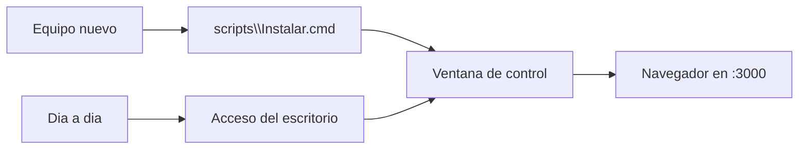
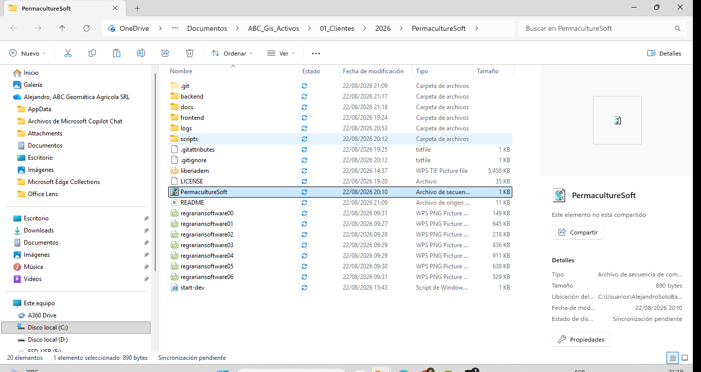
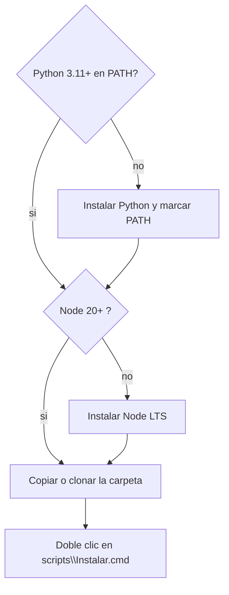
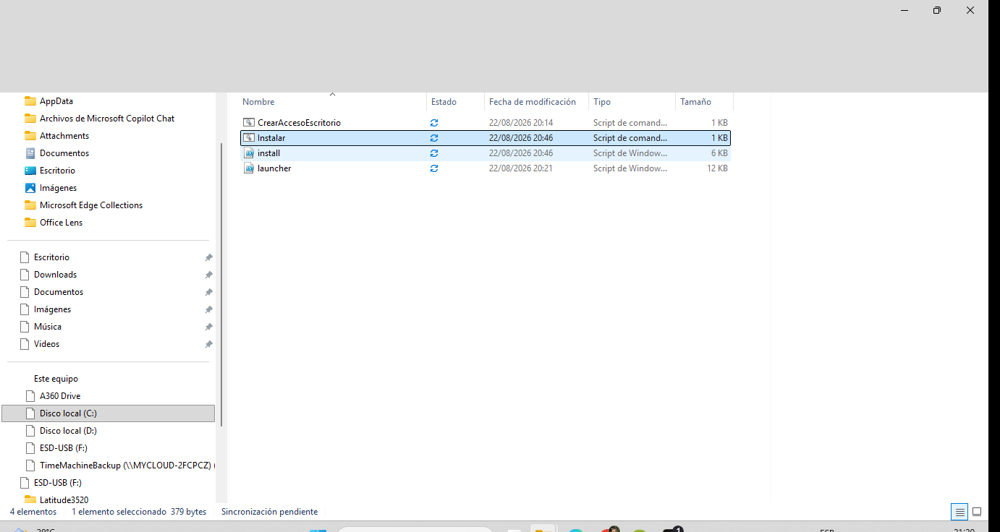
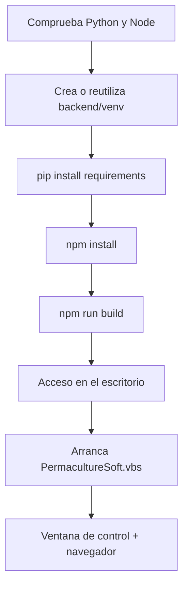
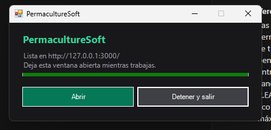
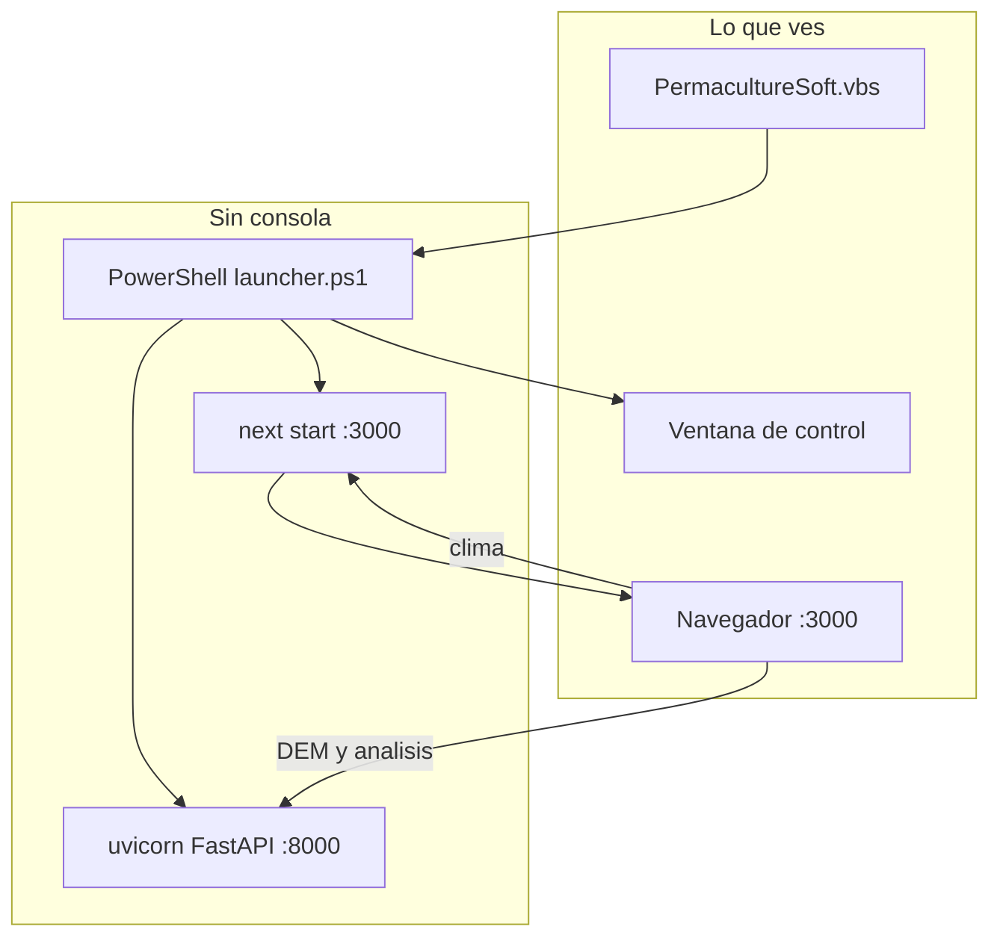

# Lanzador de escritorio

Cómo se instala y se abre PermacultureSoft en Windows, **sin terminal**.
Esta es la parte 1 del video: del doble clic hasta que el mapa está listo.
La parte 2 —clima, DEM y diseño— sigue en el [flujo de trabajo](WORKFLOW.md).

El desarrollo con recarga automática sigue siendo `start-dev.ps1`. El
lanzador sirve la interfaz **compilada** y el API de Python en segundo
plano.

---

## Dos momentos, no dos programas

| Momento | Qué pulsas | Qué ocurre |
| --- | --- | --- |
| **Una vez** (o tras `git pull`) | `scripts\Instalar.cmd` | Instala, compila, crea el icono **y abre la aplicación** |
| **Cada día** | Acceso *PermacultureSoft* del escritorio | Solo arranca; no vuelve a instalar |

No hace falta pulsar dos archivos el primer día: el instalador lanza solo
el mapa al terminar.

---

## Qué hay en la carpeta

| Entrada | Para qué |
| --- | --- |
| `PermacultureSoft.vbs` | Doble clic de diario si no usas el icono del escritorio |
| `scripts\` | Instalador y lógica del lanzador |
| `backend\` | API Python (DEM, agua, caminos…) |
| `frontend\` | Interfaz Next.js |
| `docs\` | Este archivo, el flujo y el manual |
| `logs\` | Aparece al primer arranque; no se versiona |

`start-dev.ps1` es **solo desarrollo** (recarga automática, consola a la
vista). En el video de operación no se usa.

---

## Escena A · Requisitos (equipo nuevo)

Antes de `Instalar.cmd` el equipo necesita:

1. [Python 3.11+](https://www.python.org/downloads/) — en el instalador de
   Python marca **Add python.exe to PATH**.
2. [Node.js 20 LTS](https://nodejs.org/).
3. Esta carpeta, clonada o copiada.

**Qué debes ver.** En una consola: `python --version` ≥ 3.11 y
`node --version` ≥ v20. Si `python` no se reconoce, el PATH no quedó
marcado: reinstala Python o cierra sesión y vuelve a entrar.

**Narración sugerida.** *«Dos piezas del sistema, una vez por PC. Python
con el PATH marcado. Node LTS. La carpeta del proyecto. Nada más.»*

---

## Escena B · Instalar (un clic)

Doble clic en **`Instalar`**. Se abre una consola a propósito: bajar
dependencias tarda y conviene ver el avance.

Lo que hace, en orden:

| Paso en consola | Duración típica | Si falla |
| --- | --- | --- |
| Comprobando Python y Node | 2 s | Falta PATH o versión vieja |
| Entorno de Python / pip | 2–8 min la primera vez | Red o antivirus bloqueando pip |
| npm install + build | 1–3 min | Node < 20, o `node_modules` a medias: borra y reintenta |
| Acceso en el escritorio | 1 s | Se puede recrear con `CrearAccesoEscritorio.cmd` |
| Abriendo PermacultureSoft | 2–10 s | Sigue en la escena C |

Si algo sale mal, la consola **se queda abierta** con el error. Si todo
va bien, se cierra sola y aparece la ventana de control.

Tras un `git pull`, el mismo `Instalar.cmd` recompila y vuelve a abrir.
No desinstala nada: reutiliza el `venv`.

**Narración sugerida.** *«Un clic en Instalar. La consola negra es normal
esta única vez. Cuando termina, no hay que buscar otro archivo: se abre
el programa.»*

---

## Escena C · La ventana de control

Es el único control visible. No es el mapa: es el interruptor de los
servidores.

| Elemento | Significado |
| --- | --- |
| *Preparando…* / barra que se mueve | Está arrancando o compilando (solo si no hay build) |
| **Lista en http://127.0.0.1:3000/** | Ya se puede trabajar |
| **Abrir** | Vuelve a abrir el navegador si lo cerraste |
| **Detener y salir** | Apaga backend y frontend y cierra esta ventana |

**Regla.** Mientras esta ventana esté abierta, la aplicación vive. Si la
cierras con la X o con *Detener y salir*, los servidores se apagan y el
mapa deja de responder.

Un segundo doble clic al icono, con esta ventana ya abierta, **no** lanza
otra copia: solo abre otra ventana del mapa.

**Narración sugerida.** *«Esta ventanita no se minimiza para olvidarla.
Es el encendido. Abrir relanza el navegador. Detener y salir apaga
todo. La X hace lo mismo.»*

---

## Escena D · El mapa ya está

El navegador (Edge en modo aplicación, o el predeterminado) abre
`http://127.0.0.1:3000/`. A partir de aquí el guion pasa al
[flujo de trabajo](WORKFLOW.md#escena-1--orientarse-en-la-pantalla).

Si ves el mapa y las herramientas de cuenca, tubería y camino están
**grises**, es correcto: falta el DEM. El clima sí se puede abrir ya.

---

## Uso diario

1. Doble clic en **PermacultureSoft** del escritorio (o en
   `PermacultureSoft.vbs` de la carpeta).
2. Espera *Lista en http://127.0.0.1:3000/*.
3. Trabaja. No cierres la ventana de control.
4. Al terminar: **Detener y salir**.

Para recrear solo el icono, sin reinstalar: `scripts\CrearAccesoEscritorio.cmd`.

---

## Qué corre por detrás

| Puerto | Proceso | Rol |
| --- | --- | --- |
| `127.0.0.1:8000` | FastAPI | DEM, curvas, agua, caminos, sitios, sombra |
| `127.0.0.1:3000` | Next.js | Interfaz, clima, y reenvío del resto a :8000 |

Solo escuchan en esta máquina. No se publican a la red.

Si falla algo, el detalle queda en `logs\`:

| Archivo | Cuándo mirarlo |
| --- | --- |
| `logs\launcher.log` | La ventana no pasa de *Preparando…* |
| `logs\backend.log` | «No hay conexión con el API» |
| `logs\frontend.log` | El navegador no carga o queda en blanco |
| `logs\build.log` | Falló la compilación (instalación o primer arranque sin build) |

---

## Problemas frecuentes

```mermaid
flowchart TD
  S[No abre / no carga] --> A{Hay ventana de control?}
  A -->|no| B[Falta instalacion: Instalar.cmd]
  A -->|si, Preparando| C[logs/launcher.log]
  A -->|si, Lista| D{El navegador carga?}
  D -->|no| E[Abrir, o logs/frontend.log]
  D -->|si, API error| F[logs/backend.log]
  D -->|si, herramientas grises| G[Falta importar el DEM]
```

**«Falta la instalación».** No está el `venv` o no está `node_modules`.
`scripts\Instalar.cmd`.

**El puerto 3000 u 8000 está ocupado.** Quedó otra copia (o `start-dev.ps1`).
*Detener y salir* en la ventana vieja, o cierra esa consola, y reintenta.

**La ventana se queda en Preparando…** Proxy corporativo o build a medias.
`logs\launcher.log`. El lanzador ya fuerza `127.0.0.1` y un proxy vacío.

**Se ve una versión vieja tras `git pull`.** El lanzador diario no recompila.
Otra vez `Instalar.cmd`.

**Error de PROJ al arrancar.** Una `PROJ_LIB` de PostGIS tapa la de rasterio.
`backend/projfix.py` lo corrige solo; si persiste, borra `PROJ_LIB` y
`PROJ_DATA` del entorno.

**Linux / macOS.** No hay lanzador de escritorio. Ver [README](../README.md).

---

## Guion de video · parte 1 (instalación, ~3 min)

Esta tabla **abre** el video. En el minuto 3:00 se corta a la parte 2 del
[flujo de trabajo](WORKFLOW.md#guion-de-video--parte-2-operación-12-min).

| Min | Escena | En pantalla | Off (idea, no texto literal) |
| --- | --- | --- | --- |
| 0:00 | Título | Carpeta del proyecto | PermacultureSoft se abre en el PC, sin nube ni terminal |
| 0:15 | Requisitos | python --version / node --version | Una vez por equipo: Python 3.11+ con PATH, Node 20 |
| 0:40 | Instalar | `02-carpeta-scripts.png`, clic en Instalar, consola | Un clic. La consola se ve esta vez porque tarda |
| 1:40 | Acceso | Icono nuevo en el escritorio | Queda para todos los días; hoy no hace falta tocarlo |
| 1:55 | Control | `03-ventana-control.png` | Esta ventanita es el encendido. No cerrarla |
| 2:20 | Mapa | `01-interfaz.png` del flujo | Ya se puede trabajar. Herramientas grises: falta el DEM |
| 2:45 | Puente | Zoom a *Clima del sitio* | Ahora el orden de diseño. Sigue el flujo de trabajo |

**Tomas a ensayar.** Instalar.cmd de verdad en un equipo limpio (o recorte
de una instalación previa). No acelerar la consola hasta que no se lea
un paso: si no, parece que falló.

**No grabar aquí.** Arquitectura interna, Vercel, `start-dev.ps1`, logs
salvo que algo falle en cámara.
