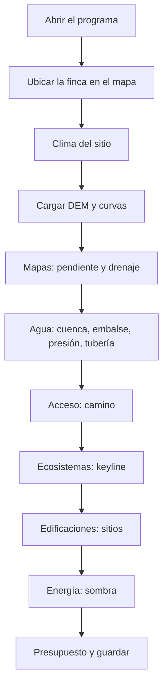
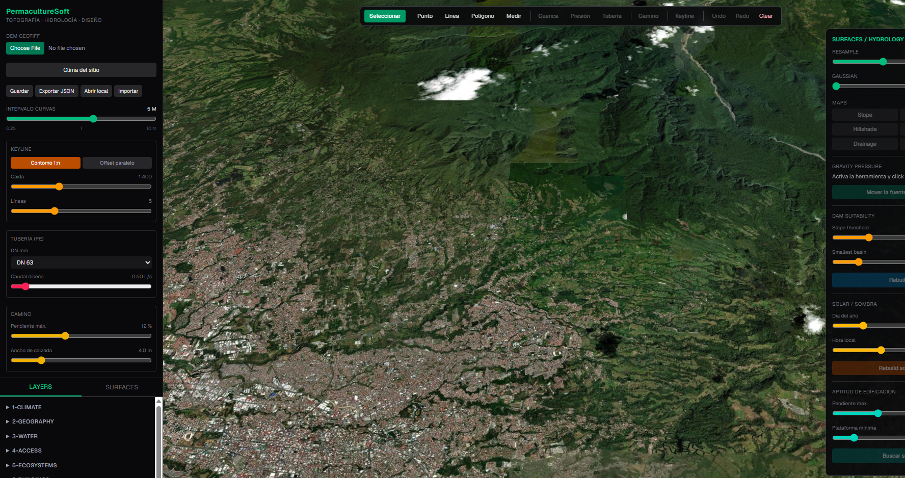
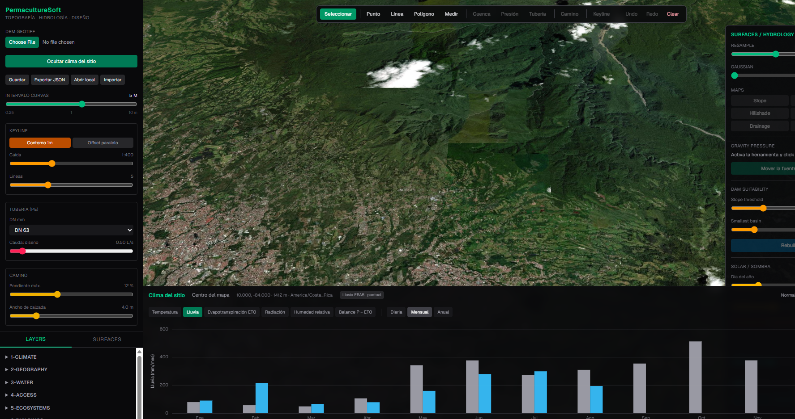

# Flujo de trabajo

Recorrido operativo de PermacultureSoft, en el orden de la Escala de
Permanencia. Cada escena dice **qué haces**, **qué debes ver** y **qué
decides**. Al final hay un guion para grabar el mismo recorrido en video.

El detalle de cada parámetro está en el [manual](MANUAL.md). El video
**empieza** por la instalación y la ventana de control, en el
[lanzador](LANZADOR.md#guion-de-video--parte-1-instalación-3-min). Este
archivo es la parte 2: del mapa en adelante.

> Prefactibilidad. El resultado sirve para descartar alternativas malas y
> llevar dos o tres opciones a campo. No es diseño de ingeniería ni
> cotización.

---

## Mapa del recorrido

El orden no es caprichoso: clima y relieve condicionan el agua; el agua
condiciona caminos y plataformas; la sombra se revisa al final, cuando ya hay
sitios candidatos.

---

## Escena 0 · Antes de abrir

Necesitas un **DEM GeoTIFF** de la finca:

| Requisito | Valor útil |
| --- | --- |
| Formato | `.tif` / `.tiff`, una banda |
| CRS | Proyectado en metros (CRTM05 / EPSG:5367 en Costa Rica, o el UTM local) |
| Celda | 1 a 10 m |
| Recorte | Solo el área de interés; recorta antes si el ráster pesa decenas de MB |

Sin DEM se puede consultar el clima del centro del mapa. Todo lo demás
(curvas, cuenca, camino, keyline, sitios) permanece gris.

En un equipo nuevo: un clic en el instalador (`scripts\Instalar.cmd` en
Windows, `scripts/install.sh` o `Instalar.command` / `Instalar.desktop` en
macOS y Linux). Después, el acceso **PermacultureSoft** del escritorio.
Deja abierta la ventana pequeña de control; **Detener y salir** apaga los
servidores.

---

## Escena 1 · Orientarse en la pantalla

Cuatro zonas, de izquierda a derecha:

1. **Panel izquierdo.** Carga del DEM, clima, guardado, y los parámetros que
   se fijan *antes* de trazar (intervalo de curvas, keyline, tubería, camino).
   Abajo, el árbol de capas por los diez niveles de permanencia.
2. **Barra superior.** Las herramientas. Las que necesitan DEM están grises
   hasta que se importe uno.
3. **Mapa.** Satélite por defecto. *Calles / Oscuro / Satélite / Topo* cambian
   el fondo. *Hillshade / terrain* añade relieve global para ubicarse.
4. **Panel derecho.** Análisis que se *reconstruyen* sobre el DEM: mapas
   derivados, presión, embalse, sombra, sitios.

La barra inferior muestra coordenadas, cota bajo el cursor y el mensaje de
estado: ahí se lee qué espera la herramienta activa («click en el aforo»,
«Enter para cerrar», etc.).

**Narración sugerida.** *«Izquierda: datos y parámetros. Arriba: herramientas.
Derecha: análisis. Abajo: coordenadas y avisos. Hasta que no hay DEM, solo
se puede dibujar, medir y consultar el clima.»*

---

## Escena 2 · Clima, antes de diseñar

Pulsa **Clima del sitio**. El panel se abre abajo. Sin DEM usa el centro del
mapa; con DEM, el polígono de la finca.

Recorre, en este orden:

1. **Mensual → Lluvia** y **Balance P − ET0.** Cuántos meses secos hay y qué
   tan profundos. Eso fija si hace falta almacenamiento y de qué tamaño
   aproximado.
2. **Anual.** La variabilidad entre años manda más que el promedio: un año
   seco extremo es el que dimensiona el reservorio.
3. **Diaria**, con *Suavizar 7 días*, para ver el arranque y el final de las
   lluvias.
4. Desplaza el panel hacia abajo: **pronóstico de 10 días ECMWF**.

La insignia junto al sitio dice de dónde sale la lluvia:

- *Lluvia CHIRPS · por área* — hay DEM; promedio sobre el polígono (~5 km).
- *Lluvia ERA5 · puntual* — no hay DEM; una celda de 11–28 km.

La primera consulta con polígono tarda ~30 s. Las siguientes salen de caché.

**Qué decides aquí.** Meses de déficit, orden de magnitud del almacenamiento,
y si el sitio es húmedo de verdad o solo lo parece en un reanálisis grueso.
No se diseña el vaso todavía: eso viene con el DEM.

**Narración sugerida.** *«Antes de dibujar una presa, mira si el clima la
justifica. Mensual responde cuántos meses secos. Anual, qué tan variable es
el año. El pronóstico de diez días está más abajo; hay que desplazarse.»*

---

## Escena 3 · Cargar el DEM

1. Ajusta **Intervalo curvas**: 0.25 / 0.50 / 0.75 m en terreno plano; 1 a
   5 m en ladera; hasta 10 m en mucho desnivel.
2. **Choose File** → el GeoTIFF → **Importar**.
3. La cámara se centra sola. Bajo `2-GEOGRAPHY` aparecen tres capas: la
   superficie, el **límite del DEM** (cian) y las curvas.

Si el DEM ya está cargado, mover el deslizador regenera las curvas sin
volver a subir el archivo. En 0.25 m las curvas enteras salen más gruesas y
las intermedias más finas. Si el desnivel no cabe, la barra de estado avisa
el intervalo realmente dibujado.

Pasa el cursor por el límite: informa hectáreas y si sigue las celdas con
dato o el rectángulo del archivo. Ese polígono es el que usa CHIRPS.

**Qué decides aquí.** Si las curvas se leen (intervalo correcto) y si el
límite coincide con la finca (si no, el ráster está mal recortado).

**Narración sugerida.** *«El DEM manda. Intervalo fino en plano, grueso en
ladera. Tres capas: superficie, perímetro y curvas. El perímetro no es
decoración: es el área de la lluvia.»*

---

## Escena 4 · Leer el relieve

En el panel derecho, con *Resample* al 50 % para explorar:

| Botón | Pregunta que responde |
| --- | --- |
| **Slope** | ¿Qué se puede cultivar, mecanizar o dejar en bosque? |
| **Drainage** | ¿Dónde se concentra el agua? Ahí van aforos y alcantarillas |
| **Wetness** | ¿Dónde se retiene humedad o se encharca? |
| **Aspect** | ¿Qué laderas miran al sol? |
| **Elevation** | ¿Hay pisos altitudinales claros? |

*Gaussian* en 1–2 solo si el DEM es de dron o LiDAR ruidoso. Para el
resultado que se entrega, sube *Resample* al 100 %.

**Medir** y **Polígono** (barra superior) dan longitud y área. Enter o doble
clic cierra. La cota bajo el cursor está siempre en la barra inferior.

**Qué decides aquí.** Zonas fuera de juego (muy pendientes, cauces, humedales)
antes de proponer nada.

**Narración sugerida.** *«Pendiente dice qué no se toca. Drenaje dice dónde
poner el aforo. No diseñes sobre una ladera que el mapa ya descartó.»*

---

## Escena 5 · Agua

Orden recomendado: drenaje a la vista → cuenca → embalse → presión → tubería.

**Cuenca.** Herramienta *Cuenca*, clic en el cauce (no en la ladera). El
mensaje de estado pide el aforo. Si la cuenca sale minúscula, el clic no
cayó en flujo concentrado: vuelve a *Drainage*.

**Embalse.** *Dam Suitability*: umbral de pendiente del vaso (8 %) y cuenca
mínima (8 ha). **Rebuild**. Compara las clases; no te quedes con el primer
punto verde.

**Presión.** *Presión*, clic en el tanque o la toma. El campo muestra, en
toda la finca, si un punto de riego se alcanza por gravedad. 10 m de
desnivel ≈ 1 bar antes de pérdidas. *Mover la fuente / Rebuild* para
probar otra cota.

**Tubería.** Fija *DN* y *Caudal* a la izquierda. *Tubería*, clic en cada
vértice, Enter para cerrar. Vigila velocidad (0,5–2 m/s) y que la pérdida
de carga no se coma la presión. Si falla, sube diámetro antes de aceptar
el trazo.

**Qué decides aquí.** Dónde se junta el agua, si hay vaso defendible, si el
riego es gravitatorio y qué diámetro aguanta el caudal.

**Narración sugerida.** *«Aforo sobre el azul del drenaje. Embalse para
ver candidatos, no para cotizar. Presión para saber si se bombea. Tubería
al final, cuando origen y destino ya no se mueven.»*

---

## Escena 6 · Acceso

Fija *Pendiente máx.* (12 % por defecto) y *Ancho de calzada*. *Camino*:
clic en origen, destino y, si hace falta, puntos intermedios. Enter.

El trazo evita pendientes fuertes y penaliza cruzar cauces. Sobre la línea
aparecen las alcantarillas. Lee en el panel: metros fuera de norma,
movimiento de tierra y presupuesto. Si hay muchos metros fuera de norma,
baja la pendiente máxima o mueve los puntos; no «aceptes» un 18 % porque
el algoritmo lo dibujó.

Es alineación preliminar: no hay curvas verticales ni radios.

**Narración sugerida.** *«Dos clics y Enter. Lo importante no es que haya
línea, sino cuántos metros se salen de la pendiente que tú fijaste.»*

---

## Escena 7 · Keyline

Modo **Contorno 1:n** (caída 1:400 a 1:1000) para conducir agua. Modo
**Offset paralelo** para el patrón de cultivo, no para hidrología.

*Keyline*: primer clic en el *keypoint* (quiebre de la vaguada, de cóncavo
a convexo; *Drainage* ayuda a verlo) y segundo clic en la dirección de
las líneas. *Líneas* fija cuántas salen.

**Narración sugerida.** *«El keypoint no es un punto cualquiera. Es donde
la vaguada cambia de forma. Si no lo ves, no dibujes el keyline.»*

---

## Escena 8 · Sitios y sombra

**Sitios.** *Pendiente máx.* y *Plataforma mínima* a la derecha. **Buscar
sitios**. Hasta ocho candidatos, de *Poor* a *Excellent*. Cruza el mapa
con el de presión y con el de drenaje: un sitio excelente en el cauce no
sirve.

**Sombra.** Día 172 y día 355, a las 8:00 y 16:00 (solsticios, extrema
sombra). **Rebuild sombra**. Decide paneles, invernadero y frutales
exigentes *después* de tener candidatos de plataforma.

**Narración sugerida.** *«Primero dónde se puede construir. Después, a
qué hora se queda sin sol. Al revés se diseña un galerón en la sombra
equivocada.»*

---

## Escena 9 · Presupuesto, guardar, cerrar

El panel izquierdo acumula tuberías y caminos en una sola tabla. Sirve
para **comparar trazos**, no para cotizar.

- **Guardar** — queda en el navegador.
- **Exportar JSON** — archivo para otro equipo o para respaldo.
- **Abrir local / Importar** — recupera.

Se guardan DEM (referencia y polígono), vectores y parámetros. No se
guardan los rásteres de análisis: se regeneran con *Rebuild*. Si se
reinicia el backend y se vació `uploads/`, hay que volver a importar el
GeoTIFF.

*Undo / Redo* (Ctrl+Z / Ctrl+Shift+Z), hasta 40 pasos. *Clear* no se
deshace. Enter cierra un trazo; Esc lo cancela.

Cierra con **Detener y salir** en la ventana de control.

**Narración sugerida.** *«Exporta el JSON si el diseño importa. Guardar
solo en el navegador se pierde al limpiar el perfil. Y no apagues la
ventana de control a la fuerza: Detener y salir cierra los servidores.»*

---

## Lista corta (un proyecto de finca)

1. Abrir. Dejar la ventana de control visible.
2. *Clima del sitio* → mensual y anual → anotar meses secos.
3. Importar DEM. Comprobar perímetro y curvas.
4. *Slope* + *Drainage*.
5. Cuenca en el cauce. Embalse. Presión desde la cota del tanque.
6. Camino origen–destino. Leer metros fuera de norma.
7. Keyline desde el keypoint.
8. Buscar sitios. Sombra en solsticios.
9. Comparar presupuesto de las alternativas. Exportar JSON.

---

## Guion de video · parte 2 (operación, ~12 min)

La **parte 1** (instalación, ventana de control, primer mapa) está en el
[lanzador](LANZADOR.md#guion-de-video--parte-1-instalación-3-min) y ocupa
los minutos 0:00–3:00. Aquí el cronómetro **sigue en 3:00**.

Una toma por escena. Texto en off, sin leer la interfaz en voz alta salvo
el nombre del botón que se pulsa.

| Min | Escena | En pantalla | Off (idea, no texto literal) |
| --- | --- | --- | --- |
| 3:00 | Orientación | Plano general como `01-interfaz.png` | Las cuatro zonas; herramientas grises hasta el DEM |
| 3:50 | Clima | Panel como `02-clima.png` | Mensual, anual, de dónde sale la lluvia |
| 5:20 | DEM | Choose file + curvas + perímetro cian | El ráster manda; intervalo según el relieve |
| 6:30 | Relieve | Slope, Drainage | Qué no se toca y dónde corre el agua |
| 7:30 | Agua | Cuenca, embalse, presión, un tramo de tubería | Aforo en el cauce; 10 m ≈ 1 bar |
| 9:30 | Camino | Dos clics, Enter, hover en alcantarilla | Mirar metros fuera de norma |
| 10:30 | Keyline | Keypoint + dirección | Contorno 1:n conduce agua |
| 11:20 | Sitios y sol | Buscar sitios + sombra solsticio | Primero plataforma, después sombra |
| 12:30 | Cierre | Tabla de presupuesto, Exportar JSON, Detener | Comparar, no cotizar; apagar en la ventana de control |
| 13:30 | Límites | Campo / DEM de mala calidad (opcional) | Contraste con estación y topografía de detalle |

Duración total con la parte 1: **~15 minutos**. Si se alarga la parte 2,
corta tubería o keyline; no cortes clima ni DEM.

**Tomas que conviene ensayar.** Clic de cuenca que falle en ladera y se
corrija sobre *Drainage*. Primera carga de clima con la espera de CHIRPS.

**Lo que no hace falta en esta parte.** Instalación, Python, Node, logs
del lanzador: eso ya se grabó en la parte 1.
